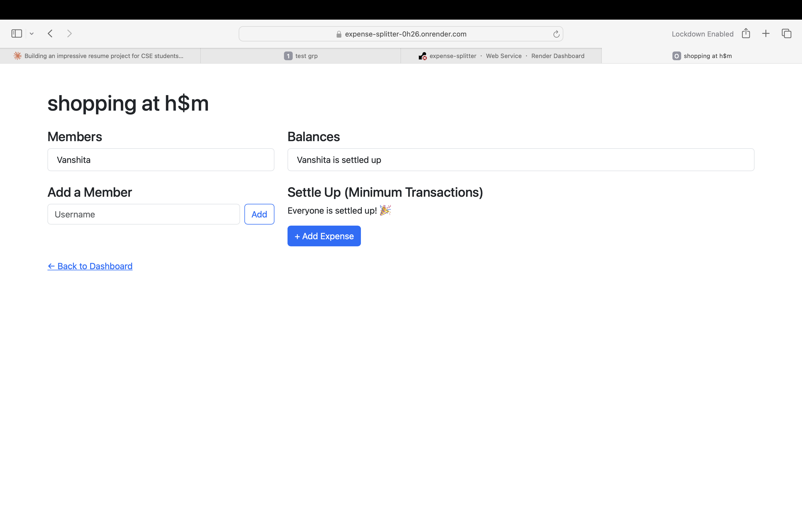
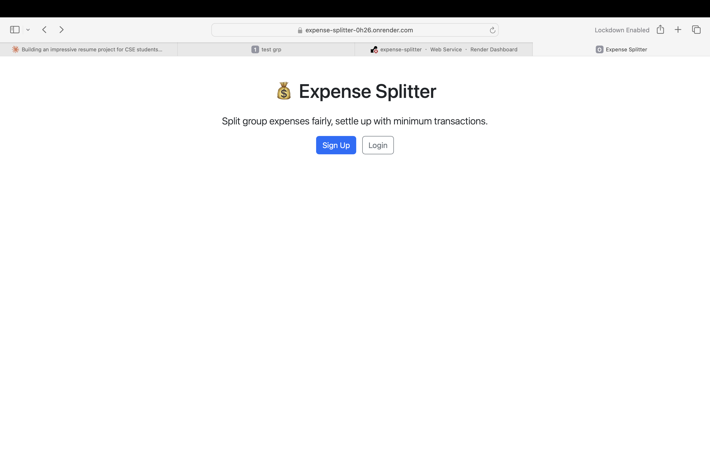
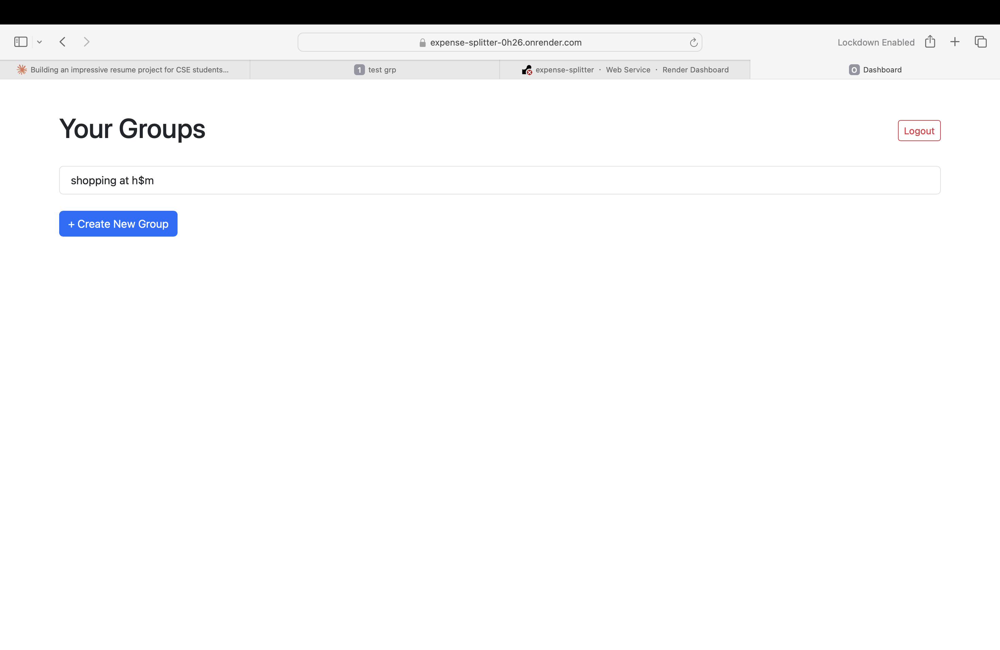

# 💰 Expense Splitter

A full-stack web app that helps groups split shared expenses fairly and settle up with the **minimum number of transactions** — instead of everyone paying everyone.

🔗 **Live demo:** [expense-splitter-0h26.onrender.com](https://expense-splitter-0h26.onrender.com)
> Note: the live demo is hosted on a free tier, so the first load after inactivity may take 30-60 seconds to wake up.

## The Problem

When a group splits expenses casually (like trip costs or shared rent), tracking who owes whom quickly becomes messy — and naive settling often requires far more transactions than necessary. This app solves both problems: it tracks every expense precisely, and calculates the mathematically minimum set of payments needed to settle everyone up.

## Key Feature: Debt Simplification Algorithm

The standout feature is a **greedy algorithm using max-heaps** that reduces settlements from a potential O(n²) transactions down to at most **n−1** transactions for n people. 

For example, with 4 people and varying balances, naive settling could take up to 6 individual payments — this algorithm guarantees it never exceeds 3.

**How it works:**
1. Calculate each person's net balance (amount paid − amount owed)
2. Separate into creditors (owed money) and debtors (owe money), each in a heap
3. Repeatedly settle the largest creditor with the largest debtor
4. Push any remaining balance back into the heap, repeat until everyone reaches zero

## Tech Stack

- **Backend:** Python, Flask
- **Database:** SQLite with Flask-SQLAlchemy (5 relational tables: User, Group, GroupMember, Expense, ExpenseSplit)
- **Auth:** Flask-Login with hashed passwords (PBKDF2)
- **Frontend:** HTML, Jinja2 templating, Bootstrap 5
- **Deployment:** Render (Gunicorn WSGI server)

## Features

- User authentication (signup/login/logout) with secure password hashing
- Create groups and add members
- Log shared expenses with automatic equal splitting
- Real-time balance calculation per group member
- **Optimal debt settlement** via greedy max-heap algorithm
- Responsive UI with Bootstrap

## Screenshots

### Homepage


### Dashboard


### Group Balances & Settle Up


## Running Locally

```bash
git clone https://github.com/singhvanshita0110-design/expense-splitter.git
cd expense-splitter
python3 -m venv venv
source venv/bin/activate
pip install -r requirements.txt
python3 app.py
```
Visit `http://127.0.0.1:5001`

## What I Learned

Building this project involved designing a normalized relational schema from scratch, implementing session-based authentication, and applying a greedy algorithm with heap data structures to solve a genuine optimization problem — connecting DSA concepts to a practical, real-world use case.